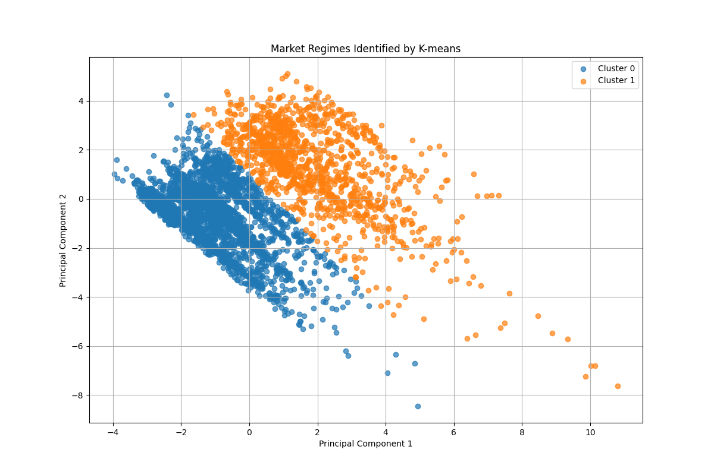
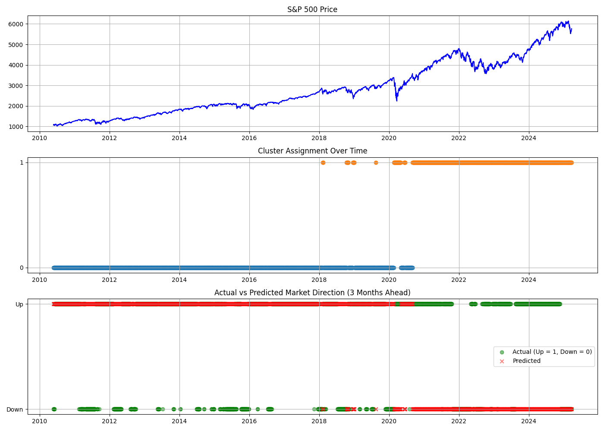

# S&P 500 Prediction with Machine Learning

> **Educational Project** - Learn Machine Learning through Financial Market Prediction

[](https://www.python.org/downloads/)
[](https://opensource.org/licenses/MIT)
[](https://github.com/IsmailMoudden/Intro-To-ML-SP500-Prediction)
[](https://github.com/IsmailMoudden/Intro-To-ML-SP500-Prediction)
[](https://github.com/IsmailMoudden/Intro-To-ML-SP500-Prediction/issues)
[](https://github.com/IsmailMoudden/Intro-To-ML-SP500-Prediction/pulls)
[](https://github.com/IsmailMoudden/Intro-To-ML-SP500-Prediction/graphs/contributors)
[](https://github.com/IsmailMoudden/Intro-To-ML-SP500-Prediction/commits/main)

---

## **About This Project**

This is a **comprehensive educational project** that teaches machine learning concepts through practical applications in financial market prediction. We focus on the S&P 500 index as our primary dataset to provide real-world context for ML learning.

### **Educational Mission**
- **Learn ML fundamentals** through financial applications
- **Understand technical indicators** and their calculations
- **Implement prediction models** from scratch
- **Practice data science workflows** with real financial data
- **Build portfolio projects** for ML learning

### ⚠️ **Important Disclaimer**
> **🚨 This project is for EDUCATIONAL PURPOSES ONLY! 🚨**
> 
> The models implemented here are **intentionally simplified** to illustrate fundamental machine learning concepts. They are **NOT** designed to provide accurate market predictions or financial advice. In fact, these models would perform poorly in real-world trading scenarios!
> 
> **Remember**: Learning ML is like learning to cook - you start with simple recipes before making complex dishes!

---

## 🏗️ **Project Architecture**

```
Intro-To-ML-SP500-Prediction/
├──  Learning_Resources/           # Educational content & theory
│   ├── About_S&P500.md             # Introduction to S&P 500
│   ├── data_handling.md            # Data processing concepts
│   ├── technical_indicators.md     # Technical analysis guide
│   └── Models/                     # Algorithm explanations
├── data/                         # Data pipeline & processing
│   ├── data_pipeline.py            # Complete data workflow
│   ├── raw/                        # Downloaded data cache
│   └── processed/                  # Cleaned datasets
├──  Clustering/                   # K-means clustering models
│   ├── K-means.py                  # Market regime identification
│   └── *.png                       # Visualization outputs
├── Regression_Models/            # Linear regression models
│   ├── Examples/                   # Guided tutorials
│   └── Implementation/             # Full implementations
├── Ensemble_Models/              # Random Forest models
│   ├── Examples/                   # Guided tutorials
│   └── Implementation/             # Full implementations
├──  notebooks/                    # Jupyter notebooks for analysis
│   ├── 01_exploratory_analysis.ipynb
│   └── 02_model_comparison.ipynb
├──  config/                       # Configuration files
│   └── config.yaml                 # Centralized settings
├── tests/                        # Unit & integration tests
└── 📋 evaluation/                   # Performance metrics & backtesting
```

---

## **Key Features**

### 📊 **Advanced Data Pipeline**
- **Automated data collection** from Yahoo Finance with intelligent caching
- **50+ technical indicators** including RSI, MACD, Bollinger Bands, SMA/EMA
- **Data preprocessing** with missing value handling and outlier detection
- **Feature engineering** with lag features, rolling statistics, and interactions
- **Temporal data handling** respecting time series integrity

### 🤖 **Machine Learning Models**
- **K-means Clustering**: Identify market regimes (bull/bear/sideways)
- **Linear Regression**: Price prediction with technical indicators
- **Random Forest**: Ensemble classification for market direction
- **Cross-validation**: Time-series aware validation to prevent data leakage
- **Performance metrics**: RMSE, MAE, R², accuracy, precision, recall

### 📚 **Comprehensive Learning Resources**
- **Step-by-step tutorials** for each concept and algorithm
- **Mathematical explanations** with formulas and derivations
- **Practical examples** with real S&P 500 data
- **Performance evaluation** guides and best practices
- **Interactive notebooks** for hands-on learning

---

## 🛠️ **Technology Stack**

| Category | Technology | Version | Purpose |
|----------|------------|---------|---------|
| **🐍 Core Language** | Python | 3.8+ | Primary programming language |
| **📊 Data Processing** | Pandas, NumPy | Latest | Data manipulation & analysis |
| **🤖 Machine Learning** | Scikit-learn | Latest | ML algorithms & pipelines |
| **📈 Visualization** | Matplotlib, Seaborn | Latest | Charts & graphs |
| **📊 Financial Data** | YFinance, TA-Lib | Latest | Market data & indicators |
| **📓 Development** | Jupyter | Latest | Interactive development |
| **🧪 Testing** | Pytest | Latest | Unit & integration testing |
| **🚀 CI/CD** | GitHub Actions | Latest | Automated testing & deployment |

---

## **Getting Started**

### **Prerequisites**
```bash
✅ Python 3.8 or higher
✅ pip package manager
✅ Git
✅ Basic understanding of Python
```

### **🚀 Quick Installation**

```bash
# 1. Clone the repository
git clone https://github.com/IsmailMoudden/Intro-To-ML-SP500-Prediction.git

# 2. Navigate to project directory
cd Intro-To-ML-SP500-Prediction

# 3. Install dependencies
pip install -r requirements.txt

# 4. Verify installation
python -c "import pandas, numpy, sklearn; print('✅ All packages installed successfully!')"
```

### **Quick Start Examples**

```bash
# K-means Clustering - Market Regime Analysis
python Clustering/K-means.py

# Linear Regression - Price Prediction
python Regression_Models/Linear_Regression/Examples/LR_Guided_Eexample.py

# Random Forest - Market Direction Classification
python Ensemble_Models/Examples/RF_Guided_Example.py

# Interactive Analysis with Jupyter
jupyter notebook notebooks/
```

---

## 🎓 **Learning Path**

### **🟢 Beginner Level (0-2 weeks)**
1. **Start Here**: Read `Learning_Resources/About_S&P500.md`
2. **Data Basics**: Study `Learning_Resources/data_handling.md`
3. **Run Examples**: Execute basic examples in each model directory
4. **Visualize**: Understand the generated charts and outputs

**Skills You'll Learn**: Basic Python, data loading, simple ML concepts

### **🟡 Intermediate Level (2-6 weeks)**
1. **Technical Analysis**: Master `Learning_Resources/technical_indicators.md`
2. **Algorithm Theory**: Study `Learning_Resources/Models/` documentation
3. **Customization**: Modify model parameters and add features
4. **Analysis**: Use notebooks for exploratory data analysis

**Skills You'll Learn**: Technical indicators, ML algorithms, data analysis

### **🔴 Advanced Level (6+ weeks)**
1. **Innovation**: Create new ML algorithms and approaches
2. **Backtesting**: Build custom trading strategy backtesting
3. **Optimization**: Implement hyperparameter tuning
4. **Deployment**: Deploy models in production environments

**Skills You'll Learn**: Advanced ML, backtesting, production deployment

---

## **Example Outputs**

### **K-means Clustering Results**

- **Market regime identification** (bull/bear/sideways markets)
- **Cluster visualization** with interactive plots
- **Performance metrics** and strategy recommendations
- **Risk assessment** for different market conditions

### **Prediction Model Results**

- **Price forecasts** with confidence intervals
- **Direction classification** (up/down predictions)
- **Model comparison** with performance metrics
- **Feature importance** analysis

### **Technical Analysis Dashboard**

- **Indicator charts** (RSI, MACD, Bollinger Bands)
- **Signal generation** for trading strategies
- **Risk assessment** and volatility analysis
- **Portfolio optimization** insights

---

## 🤝 **Contributing to the Project**

We welcome contributions from the community! This project thrives on collaboration and shared knowledge.

### **How You Can Contribute**

- **🐛 Report Bugs**: Help improve code quality
- **💡 Suggest Features**: Share ideas for new capabilities
- **📚 Improve Documentation**: Make concepts clearer for learners
- **🔧 Submit Code**: Add new algorithms or improvements
- **📊 Share Results**: Contribute backtesting results and insights

### **Contribution Process**

1. **Fork** the repository
2. **Create** a feature branch (`git checkout -b feature/amazing-feature`)
3. **Make** your changes with proper testing
4. **Commit** with clear messages (`git commit -m 'feat: add amazing feature'`)
5. **Push** to your branch (`git push origin feature/amazing-feature`)
6. **Open** a Pull Request with detailed description

### **Contribution Guidelines**

- **Follow PEP 8** for Python code style
- **Add tests** for new functionality
- **Update documentation** for new features
- **Keep it educational** - prioritize clarity over complexity
- **Respect the learning focus** of the project

---

## 📚 **Resources & References**

### **Recommended Books**
- **"Python for Finance"** - Yves Hilpisch
- **"Advances in Financial Machine Learning"** - Marcos Lopez de Prado
- **"Machine Learning for Asset Managers"** - Marcos Lopez de Prado
- **"The Elements of Statistical Learning"** - Hastie, Tibshirani, Friedman

### **Online Courses**
- [Coursera: Machine Learning for Trading](https://www.coursera.org/learn/machine-learning-trading)
- [edX: Financial Engineering and Risk Management](https://www.edx.org/learn/financial-engineering)
- [Quantopian: Algorithmic Trading](https://www.quantopian.com/)
- [Fast.ai: Practical Deep Learning](https://course.fast.ai/)

### **Communities & Forums**
- [QuantConnect](https://www.quantconnect.com/) - Algorithmic trading platform
- [Kaggle](https://www.kaggle.com/) - Data science competitions
- [Reddit r/algotrading](https://reddit.com/r/algotrading) - Algorithmic trading discussion
- [Stack Overflow](https://stackoverflow.com/) - Programming help

---

## 📞 **Contact & Support**

### **💬 Get Help**
- **Email**: ismail.moudden1@gmail.com
- **GitHub Issues**: [Report bugs or request features](https://github.com/IsmailMoudden/Intro-To-ML-SP500-Prediction/issues)
- **GitHub Discussions**: [Ask questions and share ideas](https://github.com/IsmailMoudden/Intro-To-ML-SP500-Prediction/discussions)
- **Documentation**: Check the `Learning_Resources/` directory first

### **🔗 Connect With Us**
- **GitHub**: [@IsmailMoudden](https://github.com/IsmailMoudden)
- **LinkedIn**: [Connect professionally](https://linkedin.com/in/ismailmoudden)
- **Twitter**: [Follow for updates](https://twitter.com/ismailmoudden)

---

## **License**

This project is licensed under the **MIT License** - see the [LICENSE](LICENSE) file for details.

**What this means for you:**
- ✅ **Use freely** for personal and commercial projects
- ✅ **Modify and distribute** as you wish
- ✅ **No warranty** provided (use at your own risk)
- ✅ **Attribution appreciated** but not required

---

## 🙏 **Acknowledgments**

### **Open Source Community**
- **Scikit-learn team** for the excellent ML library
- **Pandas & NumPy developers** for data processing tools
- **Matplotlib & Seaborn creators** for visualization capabilities
- **YFinance maintainers** for financial data access
---

## 🚀 **Get Started Today!**

Ready to embark on your machine learning journey with financial data?

### **⭐ Star this repository** to show your support!
### **🔗 Fork it** to start your own learning journey!
### **🤝 Contribute** to help others learn!
### **📚 Share** with fellow learners!

---

## **Happy Learning!**

*"The best investment you can make is in yourself." - Warren Buffett*

*"Education is the most powerful weapon which you can use to change the world." - Nelson Mandela*

---

<div align="center">


[](https://github.com/IsmailMoudden/Intro-To-ML-SP500-Prediction)
[](https://www.python.org/)
[](https://jupyter.org/)
[](https://scikit-learn.org/)

</div>


